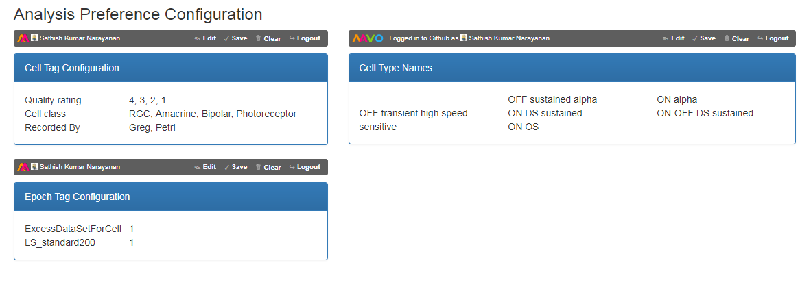

# Analysis preference files

It contains Preference files for analysis coordination and uses MAVO based web-app for creating all the configurations

https://schwartz-alalaurila-labs.github.io/sa-labs-analysis-preference/

Reference: https://mavo.io
